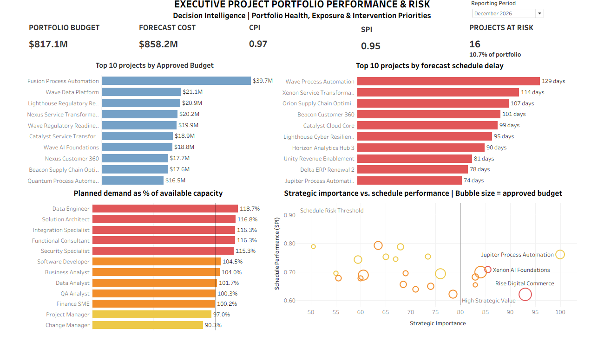

# PPM Decision Intelligence

## Executive Project Portfolio Performance, Risk, Capacity & Forecast Control

> **A portfolio analytics case study demonstrating how project
> performance data can be transformed into evidence, professional
> judgment, and executive action.**

**Tableau · Data Modeling · Project Portfolio Management · Decision
Intelligence**


------------------------------------------------------------------------

## Executive Summary

This project simulates an enterprise project portfolio environment using
**realistic synthetic Oracle PPM-style data** across **150 projects**
and **24 monthly reporting periods**.

Four Tableau dashboards examine portfolio performance, risk, resource
capacity, and forecast control. The analysis then moves beyond
visualization into a **Decision Intelligence** layer that synthesizes
the evidence, prioritizes intervention, recommends executive actions,
and defines how results should be monitored.

> ### What decision does this enable?

The project is designed around a simple principle: dashboards should not
end with reporting. They should help decision-makers determine **where
to focus, what to investigate, what to change, and what to monitor
next**.

------------------------------------------------------------------------

## Business Problem

Enterprise project portfolios generate large volumes of financial,
schedule, risk, resource, and delivery data. The management challenge is
not simply producing more reports; it is determining where leadership
attention will have the greatest value.

This case study addresses five executive questions:

1.  **Where is portfolio performance deteriorating?**
2.  **Which risks require intervention?**
3.  **Can available resource capacity support planned delivery?**
4.  **Which projects are moving away from financial and schedule
    commitments?**
5.  **Where should leadership intervene first?**

------------------------------------------------------------------------

## Portfolio at a Glance --- December 2026

  -----------------------------------------------------------------------
  Portfolio Signal                                       Certified Result
  ------------------------------ ----------------------------------------
  Projects                                                        **150**

  Forecast Cost                                              **\$858.2M**

  Forecast Overrun vs Current                                 **\$33.1M**
  Budget                         

  Projects Delayed                                   **94 / 150 (62.7%)**

  Unresolved Risks                                                 **32**

  High/Critical Unresolved Risks                                   **16**

  Capacity Coverage                                             **95.0%**

  Projects Under Combined Financial & Schedule Pressure         **71 / 150 (47.3%)**
  
  -----------------------------------------------------------------------

These measures establish the portfolio condition. The dashboards below
provide the evidence needed to determine **where intervention should be
concentrated**.

------------------------------------------------------------------------

# The Four Decision-Support Dashboards

## 1. Executive Project Portfolio Performance & Risk

**Decision question:** *Where should leadership pay attention?*



This executive overview combines portfolio financial performance,
delivery risk, resource pressure, and high-value project exposure.

**What it enables:** Portfolio-level attention setting and
identification of areas requiring deeper financial, risk, capacity, or
delivery analysis.

## 2. Portfolio Risk & Intervention

**Decision question:** *What risks are driving exposure, where are they
concentrated, and which require intervention?*


At December 2026, the portfolio contains **32 unresolved risks**,
including **16 High/Critical risks**, across **27 exposed projects**.
Resource risk is the largest unresolved category. **Rise Digital
Commerce** has the highest Open Risk Burden at **61**.

> **Governance note:** Open Risk Burden is a prioritization index based
> on unresolved risk scores. It is **not monetary exposure**.

**What it enables:** Prioritization of severe and concentrated risk
exposure rather than management by raw risk count alone.

## 3. Resource Capacity & Delivery Readiness

**Decision question:** *Can available capacity support planned
delivery?*


December 2026 planned demand is **34,180 hours** against **32,480
available hours**, leaving a **1,700-hour shortfall** and **95.0%
capacity coverage**. Ten of twelve roles are under pressure.

-   **Functional Consultant** --- largest absolute shortfall: **570
    hours**
-   **Data Engineer** --- highest relative demand pressure:
    approximately **118.8%**

Capacity coverage declined from **102.5% in January 2025 to 95.0% in
December 2026**, with planned demand exceeding available capacity
continuously from December 2025 onward.

**What it enables:** Decisions about demand sequencing, scarce-resource
allocation, delivery commitments, and specialist capacity.

## 4. Project Performance & Forecast Control

**Decision question:** *Which projects are moving away from their
financial and delivery commitments?*


The portfolio is forecast at **\$858.2M** against **\$825.1M Current
Budget**, producing a **\$33.1M forecast overrun**. **100 of 150
projects** are forecast over current budget, while **94 of 150** are
delayed.

The Financial vs Delivery Drift Matrix identifies **71 projects
(47.3%)** experiencing both forecast overrun and schedule delay.

-   **Fusion Process Automation** --- largest individual
    forecast-overrun driver, approximately **\$2.8M**
-   **Wave Process Automation** --- greatest schedule delay, **129
    days**

**What it enables:** Identification of projects requiring financial
challenge, schedule recovery, or combined corrective-action review.

> Financial overrun and schedule delay may occur together, but the
> analysis does **not** claim that one causes the other.

------------------------------------------------------------------------

# From Analytics to Decision Intelligence

> **Dashboards identify what is happening. Decision Intelligence asks
> what leadership should do about it.**

The four dashboards provide complementary evidence. The **Executive
Decision Canvas** combines that evidence into:

**Situation → Evidence → Priority → Action → Monitoring**

[**Open the Executive Decision Canvas
(PDF)**](assets/decision-canvas/executive_decision_canvas.pdf)

> **DATA → EVIDENCE → INSIGHT → PROFESSIONAL JUDGMENT → DECISION →
> ACTION**

Recommendations are not presented as facts, and dashboard signals are
not treated as automated decisions. **Professional judgment remains
between evidence and action.**

------------------------------------------------------------------------

## Executive Evidence Synthesis

### Financial pressure is broad, but intervention should be concentrated

**100 of 150 projects** are forecast above Current Budget, but the
magnitude of exposure varies materially.

### Financial and schedule pressure frequently converge

**71 projects** are simultaneously forecast over budget and delayed.
These form a natural first screening population for corrective-action
review.

### Resource capacity is a portfolio-level delivery constraint

Planned demand exceeds available capacity, and **10 of 12 roles** are
under pressure. Leadership must consider whether portfolio commitments
are realistic given constrained specialist capacity.

### Risk exposure reinforces the need for selective intervention

Half of unresolved risks are High/Critical. Leadership should prioritize
severe risks according to exposure and convergence with other adverse
signals rather than raw risk count.

> **Synthesis:** Financial overrun, schedule delay, unresolved risk, and
> resource constraints are present simultaneously, but the pressures are
> unevenly distributed. Leadership should concentrate intervention where
> multiple adverse signals converge rather than applying uniform
> corrective action across the portfolio.

------------------------------------------------------------------------

# Intervention Prioritization

  -----------------------------------------------------------------------
  Priority                Evidence Pattern        Leadership Response
  ----------------------- ----------------------- -----------------------
  **P1 --- Immediate      Multiple adverse        Review commitments,
  Executive Review**      signals converge        recovery options and
                                                  executive intervention

  **P2 --- Targeted       Material adverse signal Address the specific
  Management              in one principal        financial, schedule or
  Intervention**          dimension               risk issue

  **P3 --- Monitor**      No current evidence     Continue monitoring for
                          requiring active        deterioration
                          intervention            

  **Portfolio Capacity    Planned demand exceeds  Rebalance demand,
  Intervention**          specialist capacity     capacity, timing and
                                                  delivery commitments
  -----------------------------------------------------------------------

The P1/P2/P3 model is a **recommended intervention framework**.
Historical monthly classifications are not present in the source data
and are not represented as observed facts.

------------------------------------------------------------------------

# Recommended Executive Actions

1.  **Launch focused project recovery reviews.**
2.  **Challenge forecasts and remaining commitments.**
3.  **Rebalance constrained specialist capacity.**
4.  **Escalate severe unresolved risks.**
5.  **Establish a monthly intervention cycle.**

------------------------------------------------------------------------

# Monitoring the Intervention

  ------------------------------------------------------------------------
  Monitoring Signal           December 2026 Baseline Desired Direction
  --------------------- ---------------------------- ---------------------
  Forecast Overrun                       **\$33.1M** Down

  Combined Financial &                  **71 / 150** Down
  Schedule Pressure                                  

  High/Critical                               **16** Down
  Unresolved Risks                                   

  Capacity Coverage                        **95.0%** Toward / above 100%,
                                                     with role-level
                                                     review

  Intervention Movement             **P1 ↔ P2 ↔ P3** More projects moving
                                                     toward lower
                                                     intervention tiers
  ------------------------------------------------------------------------

Intervention Movement is a recommended future governance capability;
historical tier movement is not present in the current source data.

------------------------------------------------------------------------

# Data Architecture

The project separates business entities, periodic facts, and
Tableau-ready analytical datasets.

``` text
DIMENSIONS
  Business Unit | Project Manager | Strategy | Period | Resource Role | Project
        ↓
FACT TABLES
  Project Financials | Project Schedule | Project Risk | Resource Capacity | Project Health
        ↓
TABLEAU-READY DATASETS
  Portfolio Summary | Project Performance | Resource Capacity | Risk Analysis
        ↓
FOUR DECISION-SUPPORT DASHBOARDS
        ↓
EXECUTIVE DECISION CANVAS
```

### Grain discipline

The project intentionally preserves different analytical grains,
including:

-   **Project Performance:** Project × Reporting Month
-   **Resource Capacity:** Resource Role × Reporting Month
-   **Risk Analysis:** individual risk records within reporting periods

Incompatible grains are not forced into inappropriate physical joins
merely to simplify dashboard construction.

------------------------------------------------------------------------

# Analytical Governance & QA

The project was developed using a **build → validate → document →
freeze** discipline.

Controls include certified December 2026 totals, reporting-period stress
testing, cross-view reconciliation, grain validation, calculated-field
governance, Top-N and mark-count validation, and explicit separation of
co-occurrence from causality.

### Example QA defect

During development, the portfolio forecast-overrun trend initially
displayed **\$44.1M** for December 2026 rather than the certified
**\$33.1M**.

The root cause was two similarly named calculated fields, including a
misspelled duplicate of `Forecast Overrun`. The duplicate was removed
and references standardized:

**\$858.2M Forecast Cost − \$825.1M Current Budget = \$33.1M Forecast
Overrun**

This became a governance control: obsolete, duplicate, temporary, and
spelling-variant calculated fields should be removed or clearly
identified before certification.

------------------------------------------------------------------------

# Tools & Skills Demonstrated

**Tableau:** executive dashboard design · parameter-driven reporting
periods · calculated fields · KPI design · Top-N analysis ·
scatter/intervention matrices · trend analysis · multi-source
architecture · regression testing

**Data & Analytics:** dimensional/analytical modeling · grain management
· data validation · reconciliation · KPI governance · analytical QA ·
evidence synthesis

**Project Portfolio Management:** portfolio financial performance ·
forecast control · schedule performance · risk management · resource
capacity planning · executive governance

**Decision Intelligence:** evidence-to-decision traceability ·
professional judgment · intervention prioritization · executive
recommendations · monitoring design

------------------------------------------------------------------------

# Repository Guide

```
ppm-decision-intelligence/
├── README.md
├── .gitignore
├── _config.yml
│
├── assets/
│   ├── dashboards/
│   │   ├── dashboard_01_executive_portfolio.png
│   │   ├── dashboard_02_portfolio_risk_intervention.png
│   │   ├── dashboard_03_resource_capacity_delivery_readiness.png
│   │   └── dashboard_04_project_performance_forecast_control.png
│   └── decision-canvas/
│       └── executive_decision_canvas.pdf
│
├── data/
│   ├── dimensions/
│   │   ├── 01_dim_business_unit.csv
│   │   ├── 02_dim_project_manager.csv
│   │   ├── 03_dim_strategy.csv
│   │   ├── 04_dim_period.csv
│   │   ├── 05_dim_resource_role.csv
│   │   └── 06_dim_project.csv
│   │
│   ├── facts/
│   │   ├── 07_fact_project_financials.csv
│   │   ├── 08_fact_project_schedule.csv
│   │   ├── 09_fact_project_risk.csv
│   │   ├── 10_fact_resource_capacity.csv
│   │   └── 11_fact_project_health.csv
│   │
│   └── tableau-ready/
│       ├── 01_tableau_dataset_dictionary.csv
│       ├── tableau_portfolio_summary.csv
│       ├── tableau_project_performance.csv
│       ├── tableau_resource_capacity.csv
│       └── tableau_risk_analysis.csv
│
├── docs/
│   ├── dashboard-specs/
│   │   ├── dashboard_01_executive_portfolio_spec.docx
│   │   ├── dashboard_02_portfolio_risk_intervention_spec.docx
│   │   ├── dashboard_03_resource_capacity_delivery_readiness_spec.docx
│   │   └── dashboard_04_project_performance_forecast_control_spec.docx
│   │
│   └── decision-intelligence/
│       └── executive_decision_canvas_spec_traceability.docx
│
└── tableau/
    └── ppm_decision_intelligence.twbx

```

------------------------------------------------------------------------

# Data Integrity & Confidentiality

**All data in this project is synthetic and was created for portfolio
demonstration purposes.**

The dataset is designed to resemble realistic enterprise Oracle
PPM-style structures and analytical scenarios. It does **not** represent
any employer, client, confidential production environment, or
proprietary implementation. No real client or employer data is used.

------------------------------------------------------------------------

# Closing Perspective

> **The goal of this project is not simply to visualize project data. It
> is to demonstrate a disciplined path from data to evidence, from
> evidence to professional judgment, and from professional judgment to
> better portfolio decisions.**

**DATA → EVIDENCE → INSIGHT → PROFESSIONAL JUDGMENT → DECISION →
ACTION**
